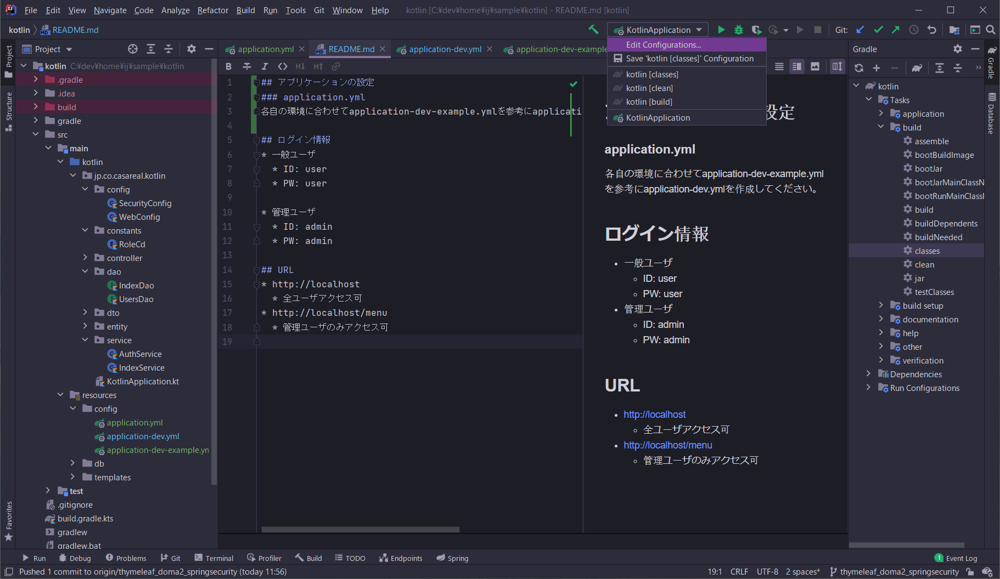
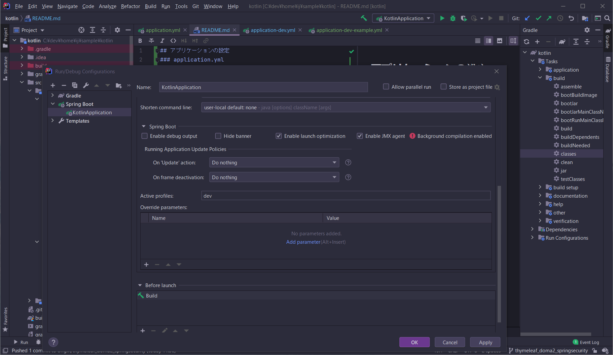

## アプリケーションの設定
### application.yml
各自の環境に合わせてapplication-dev-example.ymlを参考にapplication-dev.ymlを作成してください。 

## アプリケーションの起動
### 開発環境におけるProfileの設定方法
SpringBootのアプリケーションを選択し、「Edit Configurations...」を選択します。  

Active Profileに「dev」を入力してください。  

## ログイン情報
* 一般ユーザ
  * ID: user
  * PW: user

* 管理ユーザ
  * ID: admin
  * PW: admin

## URL
* http://localhost
  * 全ユーザアクセス可
* http://localhost/menu
  * 管理ユーザのみアクセス可
  

## DAOとEntityクラスの自動生成
* Daoを自動生成するので独自のSQL文を実装させたい場合は新しくDaoを定義してください。
* 以下のパッケージ、ディレクトリにファイルを生成します。
  * jp.co.casareal.kotlin.entity
  * jp.co.casareal.kotlin.dao（対応するテストパッケージも含む）
  * resources\META-INF\jp\co\casareal\kotlin\dao
  

Gradleタスクの**domaCodeGenDevAll**を使用するとデータベースのスキーマからDAOとEntityを作成します。  
他の場所に生成させたい場合はbuild.gradle.ktsのdomaCodeGenのタスク内で出力先を変更することができます。

### 生成されたDaoファイルの注意点
doma-spring-boot-starterに準拠する **@ConfigAutowireableは自動生成されません。**  
オプションでの設定もありませんでした。  
Gradleタスクで生成したDaoに付与させるプログラムを組み込むか、  
生成されたDaoファイルに@ConfigAutowireableを付与して使用してください。

### 生成されるEntityListenerクラスについて
>エンティティがデータベースに対し挿入、更新、削除される直前/直後に処理を実行したい場合、 @Entity の listener 要素に EntityListener の実装クラスを指定できます。

https://doma.readthedocs.io/en/2.6.0/entity/#id3

使用しない場合は  
@Entity内の`listener = IndexListener::class`を削除してください

## 単体テスト用のデータ生成について
テスト用データ生成ライブラリDbSetupおよび補助プラグインのfactlinを実装しています。

### factlinを使用したfixtureクラスの生成
gladleタスクfactlinを動かすと接続されたDBのスキーマーから  
src/test/kotlin/jp/co/casareal/kotlin/fixturesにfixturesクラスが自動生成されます。  
接続先DBを変えたい場合、生成先のフォルダを変えたい場合はbuild.gradle.ktsを編集してください。  

### DbSetupによるテストデータ生成
テストフォルダ内のjp.co.casareal.kotlin.daoimplにあるクラスに実装例があります  
そちらを参照してください。
